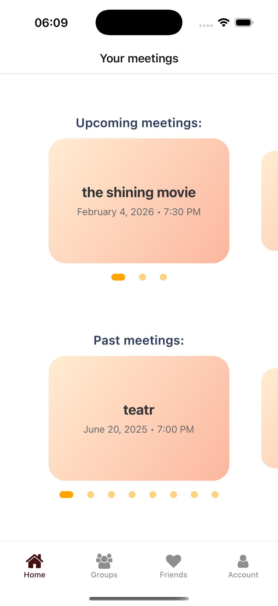
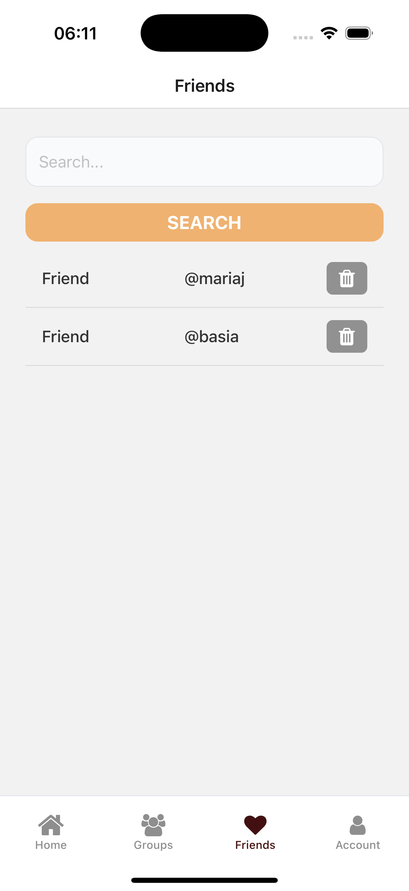
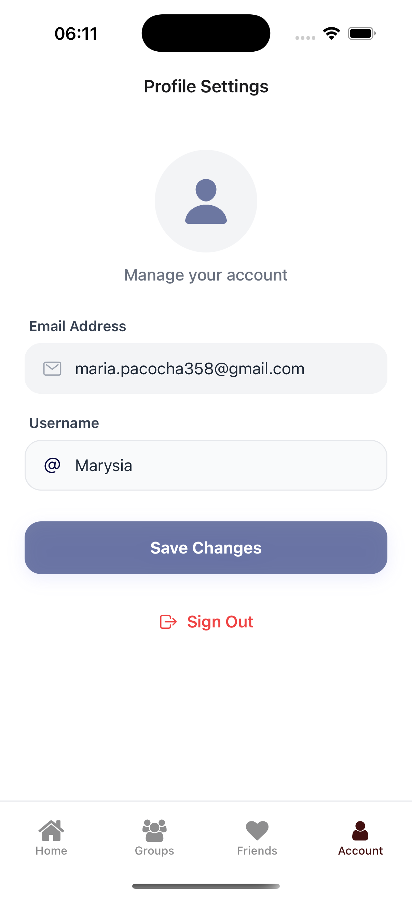
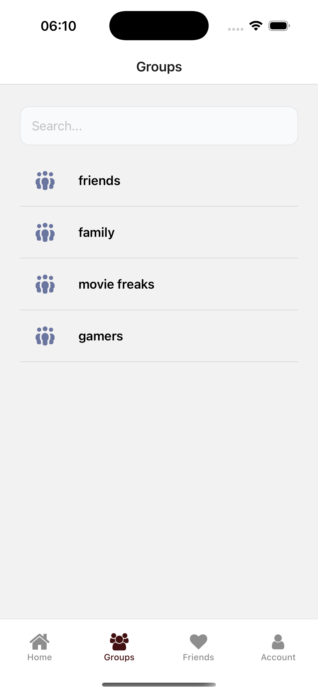
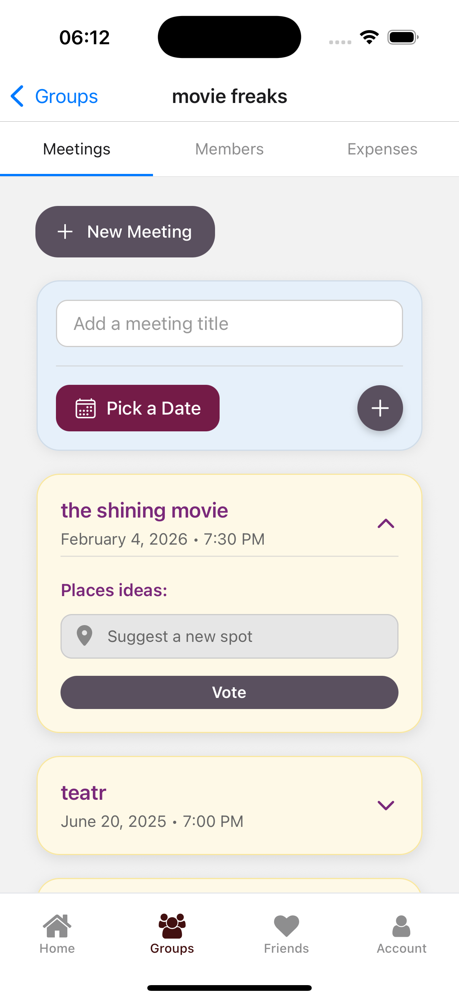
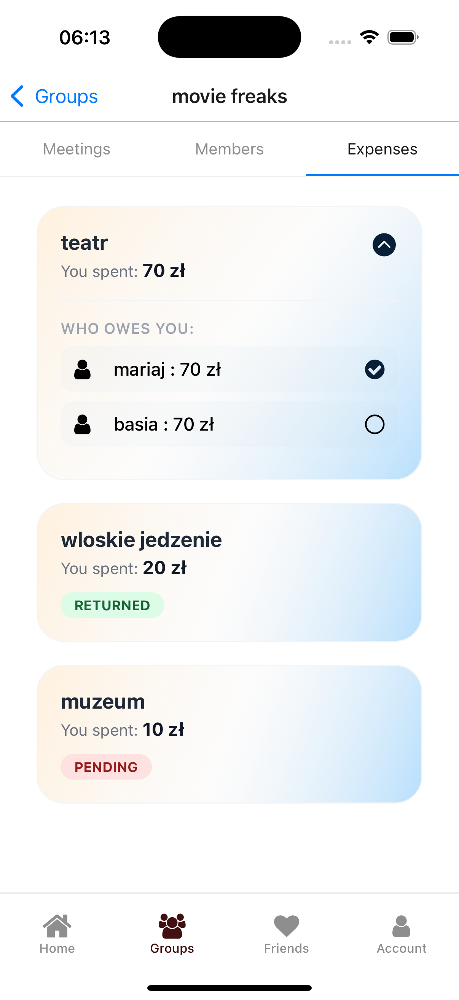
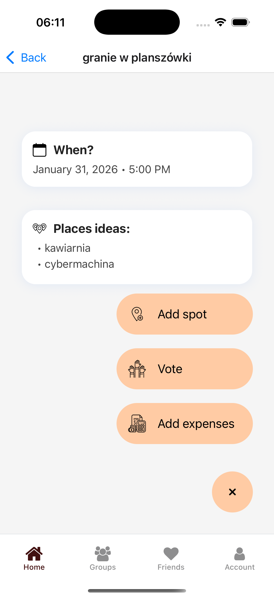
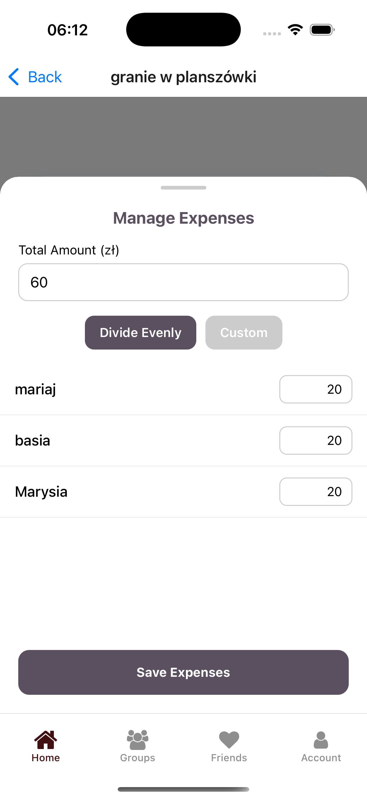
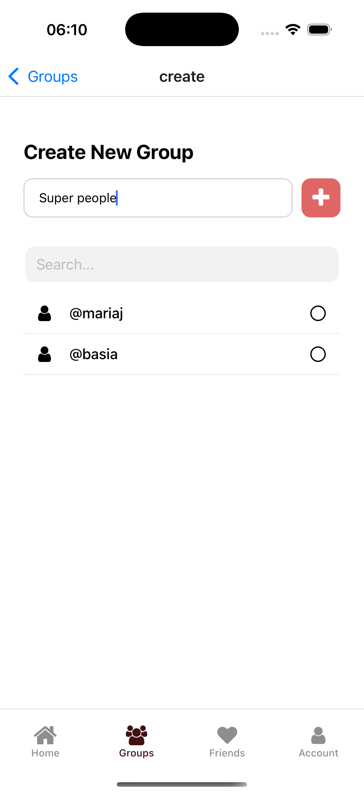

# Meeting Planner App 

A mobile application built with **React Native** and **Expo** that simplifies group meeting organization. It manages manage group gatherings, including location suggestions and individual expense tracking.

---

## Features

* **Group Organization**: Create and manage groups for different circles of friends or colleagues.
* **Social Networking**: Add and manage friends to easily invite them to groups.
* **Meeting Scheduling**: Plan upcoming events with titles, dates, and times.
* **Expense Management**: 
    * Track who paid for what.
    * Visual "Who owes you" breakdown with expanded card details.
    * Status badges for "Returned" and "Pending" payments.
* **Location Voting**: Suggest and vote on places for your next meetup.
* **User Profiles**: Secure authentication and profile customization via Supabase.

---

## Screenshots

| Home & Meetings | Friends List | Profile Settings |
|:---:|:---:|:---:|
|  |  |  |
| Dashboard for past and upcoming events. | Friend search and social connection management. | User profile management and account customization. |
| **User Groups** | **Group Navigation** | **Expense Management** |
|  |  |  |
| List of active user groups. | Tab-based navigation for meetings, expenses, and group members. | Expense breakdown with "Who owes you" details and status badges. |
| **Meeting Details** | **Add Expense** | **Create Group** |
|  |  |  |
| Detailed view for adding spots, expenses and voting on locations. | Interface for logging new costs and splitting bills among members. | Creation flow for setting up new private group circles. |

---

## Tech Stack

* **Frontend**: 
    * [React Native](https://reactnative.dev/) with [Expo](https://expo.dev/) (SDK 54).
    * [Expo Router](https://docs.expo.dev/router/introduction/) – File-based routing.
* **Backend & Infrastructure**:
    * [Supabase](https://supabase.com/) – PostgreSQL database, Authentication, and Storage.
* **Animations**: 
    * `react-native-reanimated` – For complex, 60 FPS UI interactions.
    * `LayoutAnimation` – Used for smooth expand/collapse card effects.

---

## Getting Started

### Prerequisites
* Node.js (LTS)
* Expo Go app on your phone or an Emulator (iOS/Android)

### Installation
1. **Clone the repository**
   ```bash
   git clone https://github.com/mariepcc/plan-n-go-mobile-app.git
2. **Install dependencies**
   ```bash
   npm i
3. **Configure Environment Variables**  
   Create a file named `.env` in the root directory and add your Supabase credentials:  
   ```env
   EXPO_PUBLIC_SUPABASE_URL=your_supabase_url
   EXPO_PUBLIC_SUPABASE_ANON_KEY=your_anon_key

5. **Run the application**
   ```bash
   npx expo start
